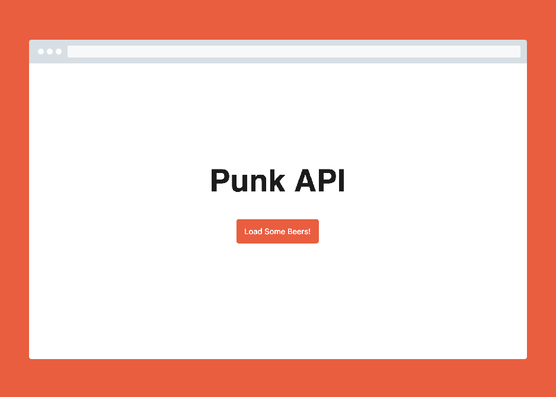
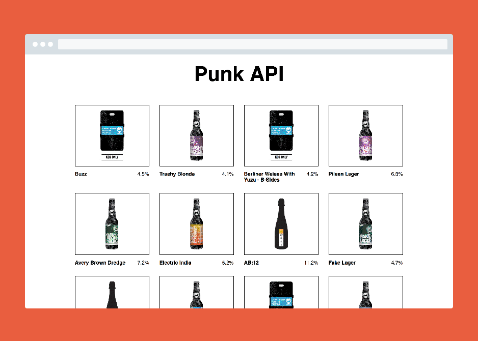

# Punk API



## Project Overview

This is a [Dynamit](http://dynamit.com) Code Day challenge. Job candidates are provided this code and a set of requirements (in-person). They have **2h - 3h** to bring this code to completion, and then present their work to a group of their future colleagues.

Candidates will have an opportunity to ask questions and to get pointed in the right direction if something is unclear.

This is an exercise in evaluating a candidate's ability to:

- Read and fulfill functional requirements
- Consume APIs
- Write event-driven JavaScript
- Work with modern tooling (Gulp, Webpack, Sass)
- Create a simple grid system

### Local development

Start the local development environment:

```
$ yarn start

or 

$ npm start
```

### Our Process

This basic setup is similar to a starting point we would have for our day-to-day project work. In our projects, we leverage the following:

* Sass
* [BEM Methodology](http://getbem.com/introduction/)
* ES6
* HTML5
* Accessibility Best Practices
* Mobile-first Responsive Design

Do your best to work within these, but don't let it limit achieving the goal. 


